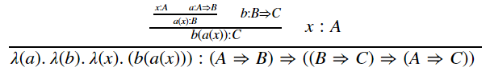

# symbolize

An attempt to implement symbolic math calculations and intuitionistic logic using Python.

# Install

```
python setup.py install
```

# Example

```python
from symbolize.logic.argument import Argument
from symbolize.logic.typetheory.proposition import implies, ImpliesPropositionExpression, not_
from symbolize.logic.typetheory.variables import A, B, C, Falsum

# switch on HTML render mode so we can display in GitHub markdown
from symbolize.expressions import Expression, Symbol
Expression.jupyter_repr_html_function = lambda self: "%s" % self.repr_unicode()

A_implies_B = implies(A, B)
B_implies_C = implies(B, C)
a = A_implies_B.get_proof('a')
b = B_implies_C.get_proof('b')
x = A.get_proof('x')

a
```
a : A ⟹ B

```python
b
```
b : B ⟹ C

```python
x
```
x : A

```python
arg1 = Argument([x, a], a(x))
arg2 = Argument([arg1, b], b(arg1.conclusion))
arg3 = Argument([arg2, x], arg2.conclusion.abstract(x))
arg4 = Argument([arg2, x], arg3.conclusion.abstract(b))
arg5 = Argument([arg2, x], arg4.conclusion.abstract(a))
arg5
```
<table>
        <tr><td style="border-bottom: 1px solid black !important;"><table>
        <tr><td style="valign='bottom';"><table>
        <tr><td style="border-bottom: 1px solid black !important;"><table>
        <tr><td style="valign='bottom';"><table>
        <tr><td style="border-bottom: 1px solid black !important;"><table>
        <tr><td style="valign='bottom';">x : A</td><td style="vertical-align:bottom">a : A ⟹ B</td></tr>
        </table></td></tr>
        <tr><td style='text-align:center;background-color:white'>a(x) : B</td></tr>
        </table></td><td style="vertical-align:bottom">b : B ⟹ C</td></tr>
        </table></td></tr>
        <tr><td style='text-align:center;background-color:white'>b(a(x)) : C</td></tr>
        </table></td><td style="vertical-align:bottom">x : A</td></tr>
        </table></td></tr>
        <tr><td style='text-align:center;background-color:white'>λ(a).λ(b).λ(x).(b(a(x))) : (A ⟹ B) ⟹ ((B ⟹ C) ⟹ (A ⟹ C))</td></tr>
        </table>

```python
new_type = arg5.conclusion.proposition_type.substitute(C, Falsum).copy()
new_type
```
(A ⟹ B) ⟹ ((B ⟹ ⟘) ⟹ (A ⟹ ⟘))

```python
new_type.walk(print)
```

    ExpressionWalkResult(expr: ⟹; obj: ⟹(⟹(A, B), ⟹(⟹(B, ⟘), ⟹(A, ⟘))); type: ImpliesPropositionSymbol)
    ExpressionWalkResult(expr: ⟹(A, B); obj: [⟹(A, B), ⟹(⟹(B, ⟘), ⟹(A, ⟘))][0]; type: ImpliesPropositionExpression; parent_type: ImpliesPropositionExpression)
    ExpressionWalkResult(expr: ⟹; obj: ⟹(A, B); type: ImpliesPropositionSymbol)
    ExpressionWalkResult(expr: A; obj: [A, B][0]; type: PropositionSymbol; parent_type: ImpliesPropositionExpression)
    ExpressionWalkResult(expr: B; obj: [A, B][1]; type: PropositionSymbol; parent_type: ImpliesPropositionExpression)
    ExpressionWalkResult(expr: ⟹(⟹(B, ⟘), ⟹(A, ⟘)); obj: [⟹(A, B), ⟹(⟹(B, ⟘), ⟹(A, ⟘))][1]; type: ImpliesPropositionExpression; parent_type: ImpliesPropositionExpression)
    ExpressionWalkResult(expr: ⟹; obj: ⟹(⟹(B, ⟘), ⟹(A, ⟘)); type: ImpliesPropositionSymbol)
    ExpressionWalkResult(expr: ⟹(B, ⟘); obj: [⟹(B, ⟘), ⟹(A, ⟘)][0]; type: ImpliesPropositionExpression; parent_type: ImpliesPropositionExpression)
    ExpressionWalkResult(expr: ⟹; obj: ⟹(B, ⟘); type: ImpliesPropositionSymbol)
    ExpressionWalkResult(expr: B; obj: [B, ⟘][0]; type: PropositionSymbol; parent_type: ImpliesPropositionExpression)
    ExpressionWalkResult(expr: ⟘; obj: [B, ⟘][1]; type: PropositionSymbol)
    ExpressionWalkResult(expr: ⟹(A, ⟘); obj: [⟹(B, ⟘), ⟹(A, ⟘)][1]; type: ImpliesPropositionExpression; parent_type: ImpliesPropositionExpression)
    ExpressionWalkResult(expr: ⟹; obj: ⟹(A, ⟘); type: ImpliesPropositionSymbol)
    ExpressionWalkResult(expr: A; obj: [A, ⟘][0]; type: PropositionSymbol; parent_type: ImpliesPropositionExpression)
    ExpressionWalkResult(expr: ⟘; obj: [A, ⟘][1]; type: PropositionSymbol)

```python
def my_sub(wr):
    if type(wr.expr) is ImpliesPropositionExpression and wr.expr.base == implies and wr.expr.children[1] == Falsum:
        wr.obj[wr.index] = not_(wr.expr.children[0])
new_type.walk(my_sub)
new_type
```
(A ⟹ B) ⟹ ((¬(B)) ⟹ (¬(A)))

```python
# switch off HTML render and render using latex
Expression.jupyter_repr_html_function = lambda self: None
arg5
```



For more examples see the Jupyter notebooks in the examples folder.

- [Syntax](examples/notebooks/Syntax.ipynb)
- [Type Theory Logic](examples/notebooks/Type%20Theory%20-%20Logic%20V2.ipynb)

# To Do

There is still lots to do initially implementing finite types and natural numbers. Futher 
into the project I would like to implement some simple symbolic manipulations and perhaps
even implement Gruntz (http://www.cybertester.com/data/gruntz.pdf)

# References

[BN] Programming in Martin-Lofs Type Theory - Bengt Nordstrom
[ST] Type Theory & Functional Programming - Simon Thompson
